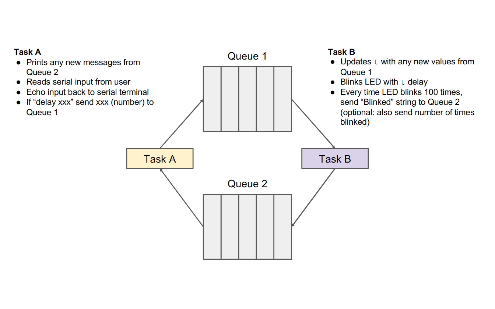

# Introduction
The aim of the lab is to implement the challenge exercise found at [introduction to rtos](https://www.youtube.com/watch?v=pHJ3lxOoWeI&list=PLEBQazB0HUyQ4hAPU1cJED6t3DU0h34bz&index=8&t=588s) at the end of the video.
# Software overview
The software is composed of two tasks A & B.

Task A is acting as a serial interface to the program. Its role is to echo back any strings/characters written by the user. If delay xxx is written the task will communicate the xxx time to task B. xxx is given in miliseconds.

Task B is tasked with controlling the frequency of the blink speed. It will await information from task A to give the target period per blink. Once the LED has blinked a total of 100 times it will write to task A indicating 100 blinks occurred.

# GCC linker optimisations used
[--ffunction-sections](https://gcc.gnu.org/onlinedocs/gcc/Optimize-Options.html#index-ffunction-sections)
